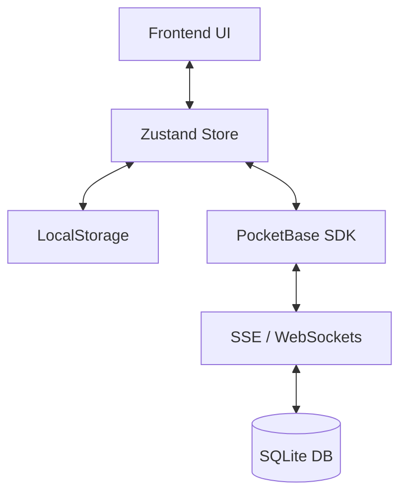

# 🏗️ Technical Architecture

ShoppingList is a distributed, reactive application designed for efficiency. This document details how all the pieces fit together.

## 🛠 Tech Stack

| Layer | Technology | Function |
| :--- | :--- | :--- |
| **Backend / DB** | [PocketBase](https://pocketbase.io/) | API, Database (SQLite), Authentication, SSE/WebSockets. |
| **Frontend** | [React](https://react.dev/) + [Vite](https://vitejs.dev/) | Single Page Application (SPA). |
| **State** | [Zustand](https://zustand-demo.pmnd.rs/) | Reactive data management with local persistence. |
| **Styles** | [TailwindCSS](https://tailwindcss.com/) | Atomic and responsive design system. |
| **Native** | [Capacitor](https://capacitorjs.com/) | Bridge for native APIs and Android/iOS packaging. |
| **Infrastructure** | Docker | Containerization and unified deployment. |

---

## 📊 Data Model (PocketBase)

The database uses SQLite. The main collections are:

- **`shopping_lists`**: Stores shared lists metadata.
- **`shopping_items`**: Products that are in an active list.
- **`catalog`**: Master dictionary of categories and suggested products.
- **`admin_config`**: Global server settings (name, backend-only mode, etc.).
- **`users`**: Basic user management and presence.

---

## 🔄 Sync Flow

1.  **Local Reactivity**: When a user checks an item, the change is instant in the UI thanks to Zustand.
2.  **Persistence**: Action status is immediately saved to `localStorage` to support reloads and offline mode.
3.  **Propagation**: The PocketBase SDK sends the change to the server.
4.  **Broadcast**: The server notifies all other connected clients via SSE (Server-Sent Events) to update their local stores.

---

## 🐳 Container Structure

The `Dockerfile` uses a multi-stage build:
1. **Stage 1 (Build)**: Compiles the React frontend.
2. **Stage 2 (Final)**: Takes the PocketBase binary and the static files compiled in stage 1, resulting in a lightweight image (~50MB).

The server serves the web application directly from the `pb_public/` folder.

---

## 🔒 Security

- **Access Rules (API Rules)**: PocketBase manages who can read/write each collection through declarative filters.
- **Backoffice**: The administration panel (`/_/`) and the user panel (`/admin`) are protected by independent passwords.
