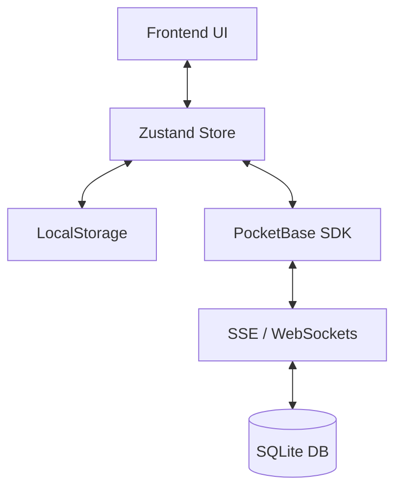

# 🏗️ Arquitectura Técnica

ShoppingList es una aplicación distribuida, reactiva y diseñada para la eficiencia. Este documento detalla cómo encajan todas las piezas.

## 🛠 Stack Tecnológico

| Capa | Tecnología | Función |
| :--- | :--- | :--- |
| **Backend / DB** | [PocketBase](https://pocketbase.io/) | API, Base de Datos (SQLite), Autenticación, SSE/WebSockets. |
| **Frontend** | [React](https://react.dev/) + [Vite](https://vitejs.dev/) | Aplicación de una sola página (SPA). |
| **Estado** | [Zustand](https://zustand-demo.pmnd.rs/) | Gestión de datos reactiva con persistencia local. |
| **Estilos** | [TailwindCSS](https://tailwindcss.com/) | Sistema de diseño atómico y responsive. |
| **Nativo** | [Capacitor](https://capacitorjs.com/) | Puente para APIs nativas y empaquetado Android/iOS. |
| **Infraestructura** | Docker | Contenerización y despliegue unificado. |

---

## 📊 Modelo de Datos (PocketBase)

La base de datos utiliza SQLite. Las colecciones principales son:

- **`shopping_lists`**: Almacena los metadatos de las listas compartidas.
- **`shopping_items`**: Los productos que están en una lista activa.
- **`catalog`**: Diccionario maestro de categorías y productos sugeridos.
- **`admin_config`**: Ajustes globales del servidor (nombre, modo backend-only, etc.).
- **`users`**: Gestión básica de usuarios y presencia.

---

## 🔄 Flujo de Sincronización

1.  **Reactividad Local**: Cuando un usuario marca un item, el cambio es instantáneo en la UI gracias a Zustand.
2.  **Persistencia**: El estado se guarda inmediatamente en `localStorage` para soportar recargas y modo offline.
3.  **Propagación**: El SDK de PocketBase envía el cambio al servidor.
4.  **Broadcast**: El servidor notifica mediante SSE (Server-Sent Events) a todos los demás clientes conectados a esa lista para actualizar sus stores locales.

---

## 🐳 Estructura de Contenedores

El `Dockerfile` utiliza un build multi-etapa:
1. **Etapa 1 (Build)**: Compila el frontend de React.
2. **Etapa 2 (Final)**: Toma el binario de PocketBase y los archivos estáticos compilados en la etapa 1, dejando una imagen ligera de unos ~50MB.

El servidor sirve la aplicación web directamente desde la carpeta `pb_public/`.

---

## 🔒 Seguridad

- **Reglas de Acceso (API Rules)**: PocketBase gestiona quién puede leer/escribir cada colección mediante filtros declarativos.
- **Backoffice**: El panel de administración (`/_/`) y el panel de usuario (`/admin`) están protegidos por contraseñas independientes.
